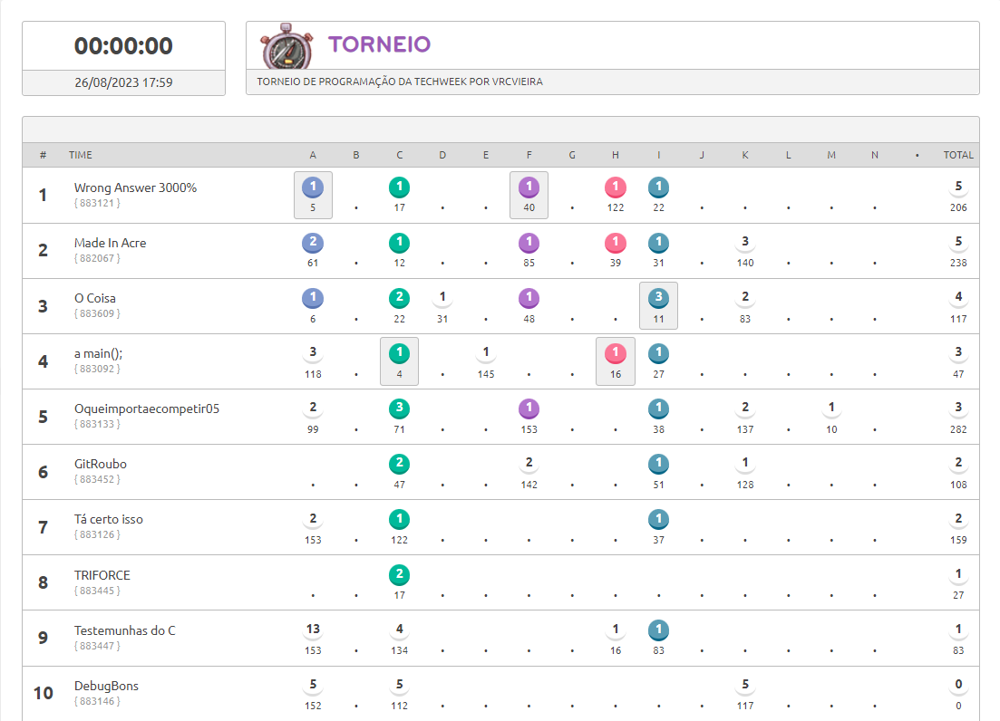

## Maratona de Programação TechWeek 2023

-   Contest
    -   [A - Figurinhas (BEE 1028)](https://github.com/tonhao-dev/Made-In-Acre/blob/main/beecrowd/1028/main.cpp)
    -   [B - Torre de Hanoi, Novamente! (BEE 1166)](https://github.com/tonhao-dev/Made-In-Acre/blob/main/beecrowd/1166/main.cpp)
    -   [C - Botas Perdidas (BEE 1245)](https://github.com/tonhao-dev/Made-In-Acre/blob/main/beecrowd/1245/main.cpp)
    -   D - Triângulos Isósceles (BEE 1378)
    -   E - Desempilhando Caixas (BEE 1438)
    -   [F - Restaurante e Pizzaria do Alfredo (BEE 1641)](https://github.com/tonhao-dev/Made-In-Acre/blob/main/beecrowd/1641/main.cpp)
    -   G - Decorando a Parede (BEE 1665)
    -   [H - Cortando Canos (BEE 1798)](https://github.com/tonhao-dev/Made-In-Acre/blob/main/beecrowd/1798/main.cpp)
    -   [I - Decifra (BEE 2464)](https://github.com/tonhao-dev/Made-In-Acre/blob/main/beecrowd/2464/main.cpp)
    -   J - Rede de Distribuição (BEE 2477)
    -   K - Emreh, Liug E As Strings (BEE 3083)
    -   L - Traveling Salesman (BEE 3201)
    -   [M - Mega Inversões (BEE 3248)](https://github.com/tonhao-dev/Made-In-Acre/blob/main/beecrowd/3248/main.cpp)
    -   [N - Ancestralidade (BEE 3347)](https://github.com/tonhao-dev/Made-In-Acre/blob/main/beecrowd/3347/main.cpp)

---

## Resultado

